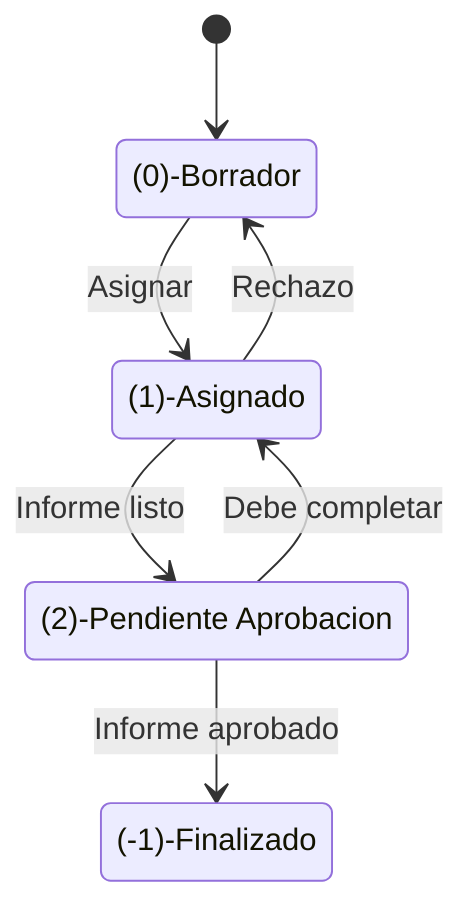
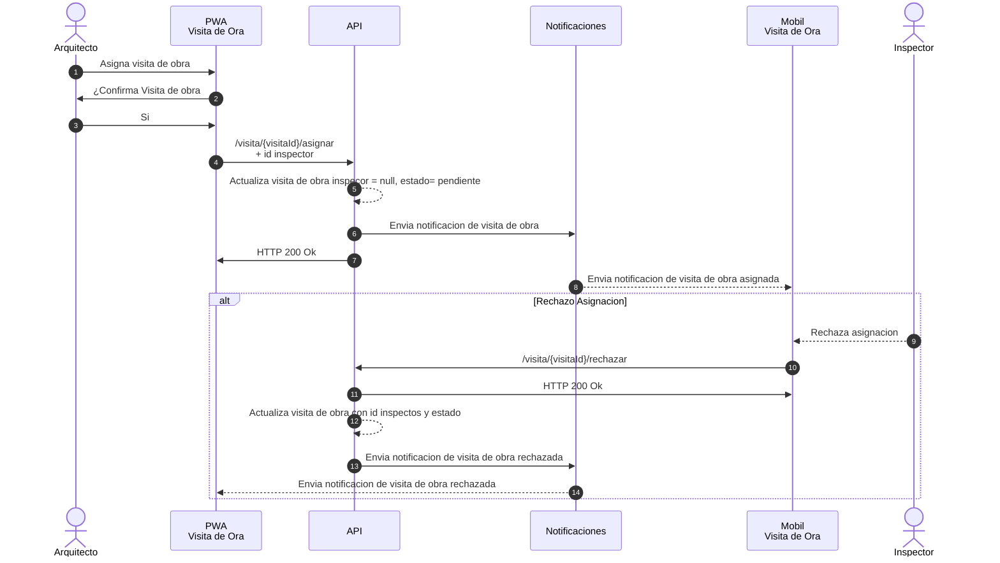

# Visita de Obra

Una empresa constructora quiere manejar de forma centralizada los informes de visita de obra de sus especialistas de seguridad e higiene.
Un arquitecto carga carga planos de obra, planificación de la obra, notas y solicitar a uno o varios inspectores que realicen una visita de obra.

## SITUACION ACTUAL

Actualmente no hay ningún sistema para la visita de obra. Un arquitecto lleva en una carpeta planos de obra, planificación de la obra, notas y cuando lo requiere envía a un inspector al sitio con una serie de indicaciones y copia de la documentación del sitio.
El inspector recauda la información en forma de notas que toma en forma manual y fotografías. Finalmente redacta un informe en Word que envía vía mail al arquitecto de la obra.
Los inspectores trabajan de forma independiente y cobran por cada visita de obra. A fin de mes el arquitecto informa al sector de pago a proveedores las visitas por inspector y se realiza el pago correspondiente.

## REQUERIMIENTOS

- Arquitectos 
   • Poder cargar de ante mano los planos de los sitios, 
   • Solicitud de inspección de sitio con verificaciones a realizar y la asignación de inspectores
   • Poder acceder a los informas de obra completados
- Inspectores / Seguridad e Higiene
   • Puedan dejar el informe en estado borrador hasta poder completarlo.
   • Puedan cargar fotos, notas y coordenadas GPS desde el sitio mediante su celular o tablet Android 
   • No todas las sitios tienen buena conexión , la aplicación debe poder almacenar la información recolectada por los inspectores y sincronizarla cuando tenga conexión estable
   • Los inspectores pueden confeccionar el informe de visita de obra (complementado por la información recabada en el sitio) desde una PC , tables o celular.
   • Recibir notificaciones de visita de obra asignada 
- Pago a proveedores
   • Ver informe de visitas de obra finalizadas

## TAREAS

Proponga una arquitectura que cumpla con los requerimientos antes mencionados especificando

A. Identifique sub-dominios (10 puntos)
B. Diagrama estructural de contenedores según el estándar C4 (30 puntos)
C. Decisiones de arquitectura de cada sub dominio  (30 puntos)
EXTRAS (DEBE TENER LOS PUNTOS A, B y C completos)
D. Diagrama de estados de un informe de visita de obra (15 PUNTOS)
E. Diagrama de secuencia de asignación de visita de obra (15 PUNTOS)

# SOLUCION

## SUB-DOMINIOS
- Core
   - Aplicacion mobil de visita de obra
- Generic
   - Autenticacion 
   - Storage de archivos
   - Servicio de notificaciones
- Supporting
   - SPA de adminsitracion de visita de obra

## DIAGRAMA

## Decisiones de arquitectura 
La aplicacion tiene dos interfaces de usuario. Pero se utilizan una arquitectura orientada a servicios para reutilizar la capa de negocio

- API Compartida para reclicalr la logica de negocio
- Dentro la API tiene una estructura por capas simple.
- OIDC y para tener SSO y tambien autenticar la API tanto para la aplicacion mobile como para la SPA
- Almacenamiento de archivos: Para almacenar las imagenes y planos se utiliza la interface S3 con AWS, la opcion tener una instancia de minio local se descarta para tener ubicuidad y alta disponibilidad.
- Firebase notifications: Se envian las notifiaciones via firebase que sirven tanto para la PWA como para la aplicacion android.
- Base de datos POSTGRESS que es de codigo fuente abierto y se peude contratar en la nube

## Estados de un informe

## Asignacion de una visita de obra

